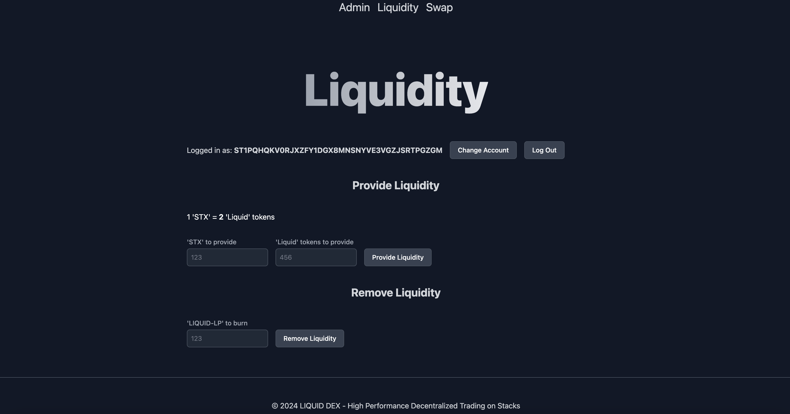

# 'LIQUID' Decentralized Exchange

> 'LIQUID' Exchange with 'LIQUID' 'LIQ' SIP010 standard token

## 📁 Table of Contents

- [General Info](#general-information)
- [Features](#features)
- [Screenshots](#screenshots)
- [Setup](#setup)
- [Contact](#contact)

## General Information

- The 'LIQUID' is an exchange for trading STX/LIQ
- Connect with your wallet, mint, provide liquidity and trade
- User can provide liquidity, swap , earn revenue from trading and remove liquidity

## Features

List the ready features here:

- Owner can mint 'LIQ' from admin panel
- Owner can set minter from admin panel
- User can connect to exchange via 'Leather' or 'Xverse' wallet
- User can provide initial liqiudity
- User can provide additional liqiudity (in that case constant formula will be applied)
- User can remove liquidity
- User can set slippage and swap STX/LIQ and LIQ/STX using AMM

## Screenshots



## Setup

### 📦 Clone/Download the Repository

## 📟 Smart Contract Deployment Setup

### 2. 🗺️ Nawigate to stacks-DEX:

```
$ cd stacks-DEX
```

### 3. 💾 Install clarinet:

You can find installation instructions for Clarinet in their Github readme: https://github.com/hirosystems/clarinet#installation

### 4. 📑 Import mnemonic:

We can deploy to Devnet, Testnet or Mainnet. The network chosen for deployment dictates the mnemonic to be used.

For Devnet deployments, the mnemonic is already included in the configurations, so there's no need for additional imports

For deployments to Testnet or Mainnet navigate to 'settings/Testnet.toml' or 'settings/Mainnet.toml' respectively. Update the file with the appropriate mnemonic as shown below:

```
[accounts.deployer]
mnemonic = "<YOUR PRIVATE TESTNET MNEMONIC HERE>"

```

### 5. 📈 Prepare deployment plan:

It is not related to devnet.

For deployments to Testnet or Mainnet we should create deployment plan. We can do that with clarinet respectively.

```
$ clarinet deployments generate --testnet --low-cost

```

or

```
$ clarinet deployments generate --mainnet --low-cost

```

### 6. 🔥 deploy:

For devnet you should have docker and run: It will deploy devnet with your contracts.

```
$ clarity devnet start

```

For deployments to Testnet or Mainnet run this respectively.

```
$ clarinet deployments apply -p deployments/default.testnet-plan.yaml

```

or

```
$ clarinet deployments apply -p deployments/default.mainnet-plan.yaml

```

### 7. ⬆️ Update frontend with deployer address:

Change contract owner address in 'frontend/lib/constants.ts

```
export const contractOwnerAddress = <Put your deployer wallet address here>

```

Example

```
export const contractOwnerAddress = 'ST1DAGPRT8MG9VYNV3QQSVYQBRCRHV2Z1KSVC9T2H'

```

## 💻 Frontend Setup

### 1. 🗺️ Nawigate to frontend:

```
$ cd frontend
```

### 2. 💾 Install Dependencies:

```
$ npm install
```

### 3. 🔥 Run NextJs app:

```
$ npm run dev
```

## Contact

Created by [@LESKOV](https://www.linkedin.com/in/ivan-leskov-4b5664189/) - feel free to contact me!
